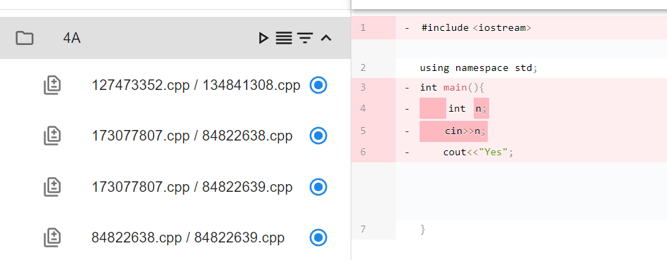

<style>
h1 {
    text-align: center;
}
h2, h3 {
    page-break-after: avoid; 
}
.center {
    margin: 0 auto;
    width: fit-content;
    margin-top: 2em;
    padding-top: 0.5em;
    padding-bottom: 0.5em;
    margin-bottom: 2em;
}
.title {
    font-weight: bold;
    border-top-style: solid;
    border-bottom-style: solid;
}
.newpage {
    page-break-after: always
}
@media print {
    @page {
        margin: 3cm;
    }
}
</style>

<h1 style="margin-top: 4em">
软件工程实验报告
</h1>

# <h1 class="center title">实验五：交互式确认方法</h1>

<div class="center">
<h3>院系：人工智能学院</h3>
<h3>姓名：方盛俊</h3>
<h3>学号：201300035</h3>
<h3>班级：人工智能 20 级 2 班</h3>
<h3>邮箱：201300035@smail.nju.edu.cn</h3>
<h3>时间：2022 年 11 月 16 日</h3>
</div>

<div class="newpage"></div>

<!-- 生成目录 -->

## <h1>目录</h1>

[TOC]

<div class="newpage"></div>

<!-- 文章主体内容 -->

## 一、版本控制

### 1. Git Commit

执行 `git commit -m "feat: init"` 进行一次初始化的 Commit，并附上 Commit 信息 `feat: init`。


执行前的 `git status`：


执行后的 `git status`：


### 2. Git Diff

`main.py` 的内容原本为：

```python
print('Hello World')
```

为了进行一次 Commit，我们将其修改为：

```python
print('Hello World')
print('Hello Software Engineering')
```

执行 `git add *` 后执行 `git commit -m "feat: change main.py"`，将变动 Commit 到 Git 仓库中。

执行 `git diff` 我们可以发现我们的更改切实地被加入到了 Git 仓库中。


### 3. Git Reset

Git Reset 命令用于重置当前 HEAD 到指定的版本。

执行 `git log` 我们可以看出我们当前有 `feat: init` 和 `feat: change main.py` 这两条 Commit。


执行 `git reset 1ad1f9` 我们就可以恢复到 `feat: init` 这一条 Commit 所在的位置。


执行 `git log`，我们发现我们确实已经回到了只有一条 Commit 的状态。


### 4. Git Revert

使用 Git Revert 命令和 Git Reset 很类似，均是要恢复到之前的某些版本，但是 Git Revert 的好处在于，会把之前的 commit history 给保留下来，并把这次撤销作为一个新的 Commit。

执行 `git reset 1409930` 来恢复 `feat: change main.py` 这条 Commit，并执行 `git log` 显示：


执行 `git revert HEAD`，我们就能撤销当前版本的修改，恢复上一个版本，并在不改变 commit history 的情况下，创建一个新的 Commit。


我们可以看出，`main.py` 文件的内容也成功回退到上一个版本了。

执行 `git log` 我们可以更清晰地看出我们做的操作：


再次执行 `git revert HEAD`，我们可以发现 `main.py` 又恢复到了最新版本，这大概就是 `git revert` 操作的“负负得正”。


### 5. Git Stash

> 有时，当你在项目的一部分上已经工作一段时间后，所有东西都进入了混乱的状态， 而这时你想要切换到另一个分支做一点别的事情。 问题是，你不想仅仅因为过会儿回到这一点而为做了一半的工作创建一次提交。 针对这个问题的答案是 `git stash` 命令。

这是 Git 官方文档对 Git Stash 命令的解释。事实上我也确实用到了这个命令。

在上一小节的 Git Revert 命令演示中，由于我是在同步编写实验报告，所以工作区实际上有一些变动，这导致我无法正常 `git revert`。


这种时候，我就可以执行 `git stash`，将我对实验报告的修改暂存了起来，这样工作区就又恢复了干净的状态，同时我们可以用 `git stash list` 查看我们放在栈上的暂存修改。


在我们做完了其他工作，想要恢复暂存的修改的时候，就可以执行 `git stash apply` 将修改恢复过来了。


### 6. Git Checkout

执行 `git checkout -b dev` 创建 `dev` 分支，并使用 `git branch` 查看。


使用 `git checkout master` 和 `git checkout dev` 可以切换分支。


### 7. Git Merge

我们修改 `main.py` 的内容为，并 Commit 到 `dev` 分支上：

```python
print('Hello World')
print('Hello Software Engineering')
print('New Branch')
```


我们执行 `git checkout master` 后执行 `git merge dev` 进行合并。


执行 `git log --graph --decorate --oneline --all` 可以看出中途 `dev` 分支被分离了出去，进行了一次 Commit 之后才被合并的。


### 8. Git Rebase

除了 Git Merge 命令之外，还有一种可以对分支进行合并的命令，即 Git Rebase 命令。

要理解 Git Rebase 命令其实很简单，我们知道每个版本其实保存了一个类似于父节点的指针，通过父节点指针我们就可以从 HEAD 一路找到初始化版本，并通过 Git Log 显示出来。理论上来说这个父节点指针不应该由我们控制，应该由 Git 自己管理，但是执行 Git Rebase 操作可以让我们更改分支的父节点指针，让当前分支的父节点指向另一个分支的最新节点，也就是“变基”操作。

我们先在 master 分支对 `main.py` 进行一点修改：

```python
print('Hello World')
print('Hello Software Engineering')
print('New Branch')
print('Change For Branch Master')
```

然后执行 `git add *` 和 `git commit -m "fix: change for branch master"` 进行 Commit。

执行 `git checkout dev` 切换到 `dev` 分支，并且同样在 master 分支对 `main.py` 进行一点修改：

```python
print('Hello World')
print('Hello Software Engineering')
print('New Branch')
print('Change For Branch Dev')
```

然后执行 `git add *` 和 `git commit -m "fix: change for branch dev"` 进行 Commit。

此时我们执行 `git log --graph --decorate --oneline --all` 看一下情况：


最关键的一步来了，我们执行 `git rebase master` 进行变基，将 dev 的父节点设为 master 的最新节点。


我们再次执行 `git log --graph --decorate --oneline --all` 看一下情况：


最后我们执行 `git checkout master` 和 `git merge dev` 让 master 分支行进到最新的节点。


### 9. Git Cherry Pick

> 对于多分支的代码库，将代码从一个分支转移到另一个分支是常见需求。
> 这时分两种情况。一种情况是，你需要另一个分支的所有代码变动，那么就采用合并（git merge）。另一种情况是，你只需要部分代码变动（某几个提交），这时可以采用 Cherry Pick。

因此我们可以知道，Git Cherry Pick 命令很类似 Git Merge 命令，只不过可以选择合并某个 Commit 而不是合并某个分支。

我们执行 `git checkout dev` 切换到 dev 分支后，添加两个 Commit。

可以看出，我们当前有两个新的 Commit：`feat: change 1` 和 `feat: change 2`。


我们执行 `git checkout master` 切换到 master 分支后，然后执行 `git cherry-pick 40fad27` 只合并 dev 分支的 `feat: change 1`。


可以看到，我们的 master 分支确实合并了 `feat: change 1` Commit。

### 10. GitHub 远程仓库

我们先在 GitHub 上创建一个新的 Repo。


执行

```sh
git remote add origin https://github.com/OrangeX4/autodiff.git
git push -u origin master
git push origin dev
```

将所有分支推送上去。


可以看见在地址 (https://github.com/OrangeX4/autodiff) 已经成功推送了上去。


除了后端部分的 Repo，我还创建了一个前端部分的 Repo (https://github.com/OrangeX4/autodiff-frontend)。


### 11. 分支合并图

这次实验中，我一共使用了 8 个分支，每个分支对应一个模块，而 master 是主分支。


使用 `git log --graph --decorate --oneline --all` 展示的分支合并图如下：


前端部分为：


## 二、代码架构

### 1. 后端模块 (Backend)

#### 1.1 主要执行模块

后端主要执行模块已经在 lab4 中讲述了，这里就不过多赘述。

大体的架构如下：

- 输入模块 (InputModule) (从一个文件夹内读取)
    - 读取源文件 (readInputFiles)
    - 读取保存的中间表示 (readDataFromFiles)
- 中间表示模块 (Data)
    - Cluster
        - 目录名 (Cluster)
        - 测试样例生成 (RandomTestGenerator)
        - 自定义测试样例 (CustomTests)
        - 文件名 (FileName)
            - 文件内容 (FileContent)
            - 并查集等价类 (EquivClass)
        - Compare
            - 文件名 1 (FileName1)
            - 文件名 2 (FileName2)
            - 自动比较结果 (AutoResult)
            - 人工确认结果 (ManualResult)
- 输出模块 (OutputModule) (输出到一个文件夹)
    - 输出 CSV 文件 (writeCSVFiles)
    - 输出中间表示 (writeDataToFiles)
- 多进程并行计算模块 (ParallelComputing)
    - 根据 Cluster 和 FileName 生成工作 (generateWorks)
    - 调用 AutoCompare 进行文件的比较 (dispatch)
- 自动比较模块 (AutoCompare)
    - 根据文件后缀名判断文件类型 (c or cpp)
    - 通过 GCC 等方式编译然后运行 (compare)

#### 1.2 基于 Flask 的服务器模块

为了前后端分离，我们还需要一个能够提供后端接口的服务器模块 (Server)，这里我选用了 Flask 模块来实现后端服务器。

Flask 模块可以很简单地就为前端模块提供必要的功能，例如读取 Clusters 数据文件等：

```python
def get_cluster(cluster_name) -> Dict:
    '''
    获取 cluster dict 的函数, 并且更新 diff_list
    '''
    cluster = clusters[cluster_name]
    cluster_dict = cluster.cluster
    cluster_dict['diff_list'] = output.cluster_to_diff_list(cluster_name)
    return cluster_dict

@app.route("/clusters", methods=['GET'])
def handle_clusters():
    result = {}
    for cluster_name in clusters:
        result[cluster_name] = get_cluster(cluster_name)
    return result
```

其中方法注解 `@app.route("/clusters", methods=['GET'])` 代表着将这个 API 映射到 `http://host:port/clusters` 上，可以通过 GET 方法来获取到所有的 clusters 数据。

同理，我还实现了其他接口：

- `http://host:port/clusters` (GET): 获取到所有的 clusters 数据；
- `http://host:port/cluster/<cluster_name>` (GET): 获取某个 cluster 数据；
- `http://host:port/run` (POST): 为某个 cluster 执行自动并行比较；
- `http://host:port/update` (POST): 为某个 cluster 更新人工比较结果；
- `http://host:port/csv` (GET): 下载当前的 CSV 文件内容。

为了将前端后端模块合并，这里我们需要使用 `npm run build` 生成编译后的前端静态文件，然后将静态文件移动至后端 `./server/static` 文件夹下。

然后我们就可以通过 Flask 托管我们的前端静态文件了：

```python
# Flask
app = Flask(__name__,
            static_url_path='',
            static_folder='static')
```


### 2. 前端模块 (Frontend)

#### 2.1 UI 设计

前端模块使用 **React**、**material-ui**、**react-diff-viewer** 以及高亮库 **Prism** 实现。 


如图所示，主要分为三大部分：

- 侧边栏目录模块 (Sidebar)
    - 侧边栏左上角的按钮可以「**下载 CSV 文件**」
    - 侧边栏右上角的目录可以切换 「**是否收起侧边栏**」
    - 每个文件夹作为一个 Cluster
    - 每个 Cluster 有四个按钮
        - **执行按钮**，调用后端等价判断工具进行比较
        - **显示按钮**，切换显示模式 (Diff 模式 / Folder 模式)
        - **过滤按钮**，切换是否过滤已判定的文件对 (过滤掉绿色和红色 Diff)
        - **收起按钮**，切换展开或者收起
    - 每个 Diff 行后有一个 “状态”
        - 绿色代表 “人工确认等价”
        - 蓝色代表 “自动判断等价”
        - 黄色代表 “仍未进行判断”
        - 红色代表 “不等价”
- Diff 显示模块 (DiffViewer)
    - 显示两个代码文件之间的差异
- 人工确认模块 (ConfirmButton)
    - 右上角有四个按钮，可以进行人工的等价确认
        - 绿色代表 “人工确认等价”
        - 蓝色代表 “自动判断等价”
        - 黄色代表 “仍未进行判断”
        - 红色代表 “不等价”

#### 2.2 MVC 设计模式

前端模块使用了 MVC 设计模式。


- **Model**：Cluster 类作为 Model，存储了用到的目录、文件以及等价判断结果等信息。
- **Controller**：WebServer 模块和 React 框架作为中间层，负责连接 Model 和 View。Controller 从 Model 中获取数据信息，并且实时地映射到前端的 View 中。
- **View**：由侧边栏 (Sidebar)、Diff 显示 (DiffViewer) 以及等价确认按钮 (ConfirmButton) 等部分组成的 View，用于实时显示 Model 中拥有的数据，并对用户操作做出反馈。

#### 2.3 用户交互

使用 **活动图** 表示具体的过程如下：


用户的关键在于处理好每个文件 Diff 对的四种状态：

- 绿色代表 “人工确认等价”
- 蓝色代表 “自动判断等价”
- 黄色代表 “仍未进行判断”
- 红色代表 “不等价”


### 3. 中间表示与等价类 (Cluster)

我们使用一个中间表示类 Cluster，来表示我们当前处理的数据的状态。

```json
{
    "cluster_name": "4A",
    "random_input_generator": {
        "type": "stdin_format.txt",
        "content": "int(1, 3)"
    },
    "custom_input": [ "1", "2" ],
    "config": {
        "random_test_times": 10,
        "random_seed": 0,
    },
    "files": {
        "48762087.cpp": {
            "content": "int main() { return 0; }",
            "equiv_class": "48762087.cpp"
        },
        "84822638.cpp": {
            "content": "int main() { return 0; }",
            "equiv_class": "48762087.cpp"
        }
    },
    "equiv": [["48762087.cpp", "84822638.cpp"]],
    "unequiv": [],
    "diff": {
        "48762087.cpp": {
            "84822638.cpp": {
                "auto": "unknown",
                "manual": "equiv",
                "logic": "equiv"
            }
        },
        "84822638.cpp": {
            "48762087.cpp": {
                "auto": "unknown",
                "manual": "equiv",
                "logic": "equiv"
            }
        }
    }
}
```

其中 `files` 属性下的 `equiv_class` 用的是一个 **并查集结构**，我们用并查集来标识该文件所属的 **等价类**。


如图所示：

- 在同一个等价类里的文件被认为是 **相互等价** 的，通过一个根文件来表标识等价类，例如下面的那个等价类通过 `File 5` 标识。
- 在不同等价类之间，通过实线连接的等价类被认为是 **不等价** 的，即两个等价类里的文件两两匹配都不等价。
- 在不同等价类之间，通过虚线连接的等价类被认为是 **未知等价关系** 的，需要用户进一步地判断 (虚线是初始化后就存在的)。

借助这幅图所示的等价类概念，以及并查集的算法知识，我们就可以写出一个能够让用户 **手动动态更改等价关系** 的 Cluster 类。

由于代码有数百行，就不在报告中过多展示，感兴趣可以查阅代码 `cluster/__init__.py`。

代码还包括了一个简易的单元测试：

```python
cluster = Cluster('test', cluster)
cluster.clear()
cluster.set_manual('1', '2', 'equiv')
cluster.set_manual('2', '3', 'equiv')
cluster.set_manual('2', '3', 'unequiv')
cluster.set_manual('2', '3', 'unknown')
cluster.set_manual('3', '4', 'equiv')
cluster.set_auto('2', '3', 'unequiv')
cluster.update_diff()
print(cluster.cluster)
```

可以看出，接口是很易用的，在等价确认工具中便使用了这个接口。


## 三、运行流程

### 1. 直接运行

第一步，需要先将后端项目 clone 下来

(或者直接移动到 `./code/autodiff` 文件夹下，和重新 clone 效果等同)

```sh
git clone https://github.com/OrangeX4/autodiff.git
```

第二步，安装 Python 开发环境 (并且安装 Flask 模块)。

```sh
pip install Flask
```

第三步，往 `data/input` 里加入数据，例如 `4A/xxx.cpp`、`50A/xxx.cpp` 等。

第四步，切换到 `server` 模块下。

```sh
cd ./server
```

第五步，执行 `python __init__.py` 以运行服务器模块：

```sh
python __init__.py
```

第六步，此时会自动打开一个页面，这就是我们的操作界面，对应的地址为 http://localhost:7376/.


第七步，打开某个 Cluster 对应的 Diff，此时发现每一行 Diff 显示都还有「**黄色**」标志，这代表着还未进行「程序自动随机测试比对」。


第八步，点击切换显示方式按钮，可以从「文件树模式」转换为「列表模式」。


第九步，点击运行按钮，可以进行 **自动执行比对**。


第十步，此时可以看见已经出现了红色的状态，我们可以点击过滤按钮，过滤掉「**绿色**」和「**红色**」的 Diff。




第十一步，点开某个 Diff，例如这里的 `84822638.cpp / 84822639.cpp`，这里显示为蓝色，证明其已经通过了自动随机测试，对于相同的输出有着相同的输出结果。


第十二步，我们人工判断这个 Diff 相等，我们点击「绿色按钮」，将其人工分类为「等价」，**此时侧边栏要人工确认的文件对从 4 个变为 3 个**。


第十三步，同理，如果我们将 `173077807.cpp / 84822638.cpp` 其人工分类为「等价」。


由于 `84822638.cpp / 84822639.cpp` 也是等价的，因此 `173077807.cpp / 84822639.cpp` 也会 **自动判定为等价**。

这说明我们通过等价类的方式，实现了根据用户的人工判定结果，自动推荐下一个需人工确认的等价对的功能。

**此时侧边栏要人工确认的文件对从 3 个变为 1 个**。


第十四步，通过左上角的「下载 CSV 文件」按键下载当前的 CSV 文件。


### 2. 更新前端

如果需要更新前端代码，可以执行

```sh
cd ./code/autodiff-frontend
```

切换到前端项目，然后执行

```sh
npm start
```

即可开启「开发模式」，此时修改代码的话，页面会自动「热更新」。

编辑完成后，执行

```sh
npm run build
```

可以生成编译后的前端静态文件 `./build`，这时我们将其移动到后端的

```text
./server/static
```

目录中，注意要将 `build` 整个文件夹移动过去，删除原来的 `./server/static`，然后将 `build` 重命名为 `static`。

### 3. 删除中间文件

如果你想要消除你已经执行的操作，或者想要删除自动随机测试的结果，你需要删除 `./data/clusters` 下的所有文件，例如

```text
./data/clusters/4A.json
./data/clusters/50A.json
```

这些文件是给不同 Clusters 保存的中间结果。

## 四、优秀设计

### 1. 美观的 UI 以及拥有高亮的 Code Diff 界面


我为项目加入了类似 VS Code 的 Code Diff 界面，可以让用户更简单地进行人工确认。

### 2. 收起和展开侧边栏


这个按钮可以用于收起和展开侧边栏。

### 3. 用户自主切换 Diff 对的显示方式


「显示按钮」和「过滤按钮」可以让用户自主切换 Diff 对的显示方式。

### 4. 简单易懂的用户提供交互选项


为用户提供交互选项 (例：等价，不等价，存疑等)。

### 5. CSV 文件下载按钮


通过左上角的「下载 CSV 文件」按键下载当前的 CSV 文件。

### 6. 自动保存 Clusters 当前数据


我们会自动保存当前的 Clusters 数据到 `./data/clusters` 目录下。

因此我们不需要每次都重新执行「自动随机测试比对」和「人工确认」等工作，我们会随时保存当前 Clusters 的数据，用户不用担心数据的遗失。

### 6. 基于并查集的等价类

我们使用 `cluster` 模块 `files` 属性下的 `equiv_class`  的一个 **并查集结构** 来标识该文件所属的 **等价类**。


如图所示：

- 在同一个等价类里的文件被认为是 **相互等价** 的，通过一个根文件来表标识等价类，例如下面的那个等价类通过 `File 5` 标识。
- 在不同等价类之间，通过实线连接的等价类被认为是 **不等价** 的，即两个等价类里的文件两两匹配都不等价。
- 在不同等价类之间，通过虚线连接的等价类被认为是 **未知等价关系** 的，需要用户进一步地判断 (虚线是初始化后就存在的)。

借助这幅图所示的等价类概念，以及并查集的算法知识，我们就可以写出一个能够让用户 **手动动态更改等价关系** 的 Cluster 类。

### 7. 测试样例的多样性

除了 `stdin_format.txt` 外，我还添加了 `stdin_format.py` 和 `config.json` 等额外的配置文件，以及自定义测试样例，可以进行更灵活的随机样例生成和配置。

- `stdin_format.txt`：使用正则表达式实现的文本替换与随机生成。
- `stdin_format.py`：通过用户自定义 Python 程序来实现更复杂的 (如数组、矩阵) 的输入样例生成。
- `config.json`：可以配置 **生成随机样例的个数** 以及 **随机数种子** 等配置。

### 8. 并行多进程计算

并行地进行「**文件编译**」和「**文件比对**」，并且采用了 **多进程** 与 **进程池** 的策略来实现并行计算。

设定了进程池最大为 8 个进程，因此执行速度是原来的 8 倍。

### 9. 前后端分离

这次项目的前后端是分离的，因此可以通过接口的方式为更多的界面提供支持：

- `http://host:port/clusters` (GET): 获取到所有的 clusters 数据；
- `http://host:port/cluster/<cluster_name>` (GET): 获取某个 cluster 数据；
- `http://host:port/run` (POST): 为某个 cluster 执行自动并行比较；
- `http://host:port/update` (POST): 为某个 cluster 更新人工比较结果；
- `http://host:port/csv` (GET): 下载当前的 CSV 文件内容。

无论是 Web 界面，还是 Android 程序，还是 Qt 界面，只要使用了这些 API 接口，都可以兼容这个后端项目，实现「N + N」到「1 + N」的项目开发效率优化。